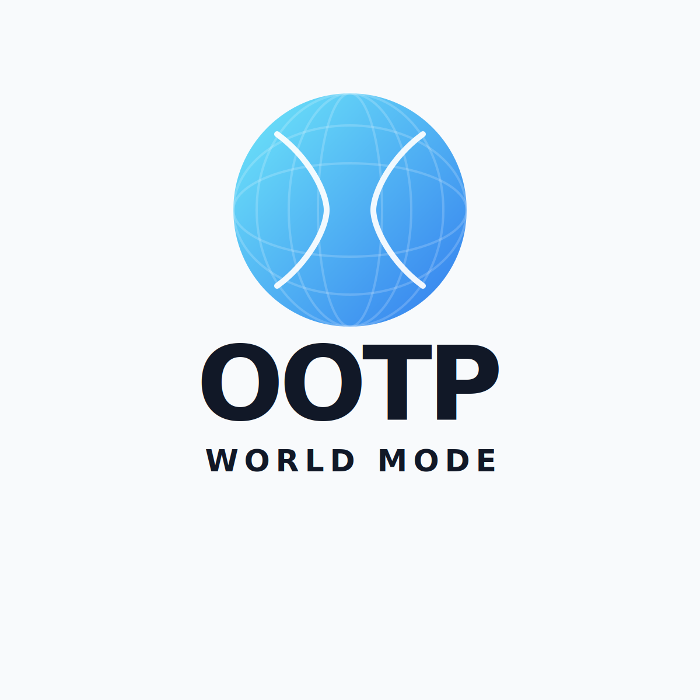

  

# The World Mod

[English](./README.md)

> 현재 배포 상태: 베타

OOTP 27용으로 제작된 독립 퀵스타트 배포본입니다.

이 배포본은 OOTP 27용 커스텀 퀵스타트인 `THE_WORLD_MOD.quick` 자체와, 월드 세이브를 더 풍부하게 만들어주는 각종 보조 리소스를 함께 포함합니다.

## 포함 내용

- `THE_WORLD_MOD.quick` 커스텀 퀵스타트
- 국제 리그 분위기를 살려주는 시각 리소스
- 추가 로고, 유니폼, FaceGen, 구장 리소스
- 더 풍부한 월드 세이브 구성을 위한 보강 요소

## 폴더 구성

- `THE_WORLD_MOD.quick`: 커스텀 퀵스타트 본체
- `the-world-mod`: 보조 리소스 파일

## 적용 방법

1. `THE_WORLD_MOD.quick`를 OOTP 27의 퀵스타트 폴더에 복사합니다.
2. 추가 리소스까지 함께 쓰려면 `the-world-mod` 안의 파일도 OOTP 27 데이터 폴더에 맞게 복사합니다.
3. 이미 같은 이름의 파일이 있다면 백업 후 교체하는 것을 권장합니다.

## Special Thanks To

- [silvam14](https://forums.ootpdevelopments.com/): 이번 배포본에 포함된 여러 NPB 구장 제작
- [LazyQuokka1218](https://github.com/LazyQuokka1218): 유니폼 및 FaceGen 작업
- 자세한 자산별 출처는 [CREDITS.md](./CREDITS.md)에서 확인할 수 있습니다
